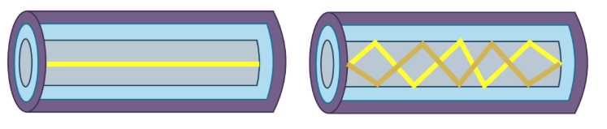

# Trabajo Practico N3

- **Gastón E. Capdevila**
- **Nicolas Seia**
- **Ignacio Ledesma**
- **Tomás Viberti**  
 
## Ensalada WANdorf

**Facultad de ciencias Exactas Fisicas y Naturales**  

**Comunicaciones de datos**

**Profesores:**
- SANTIAGO MARTIN HENN
- OLIVA CUNEO FACUNDO NICOLAS 

**19/9/2025**   

---

### Información de los autores
 
- gaston.capdevila@mi.unc.edu.ar
- nicolas.seia@unc.edu.ar
- iledesma@mi.unc.edu.ar
- tomas.viberti@mi.unc.edu.ar

## Resumen

Este trabajo práctico aborda el estudio de las capas de acceso en redes locales y los fundamentos asociados, con especial énfasis en los estándares IEEE 802.3 y 802.11, su evolución histórica y las diferencias clave entre versiones. Se incluyen actividades prácticas como la conexión a redes abiertas de la Facultad para identificar protocolos y sistemas de seguridad utilizados, además de reflexionar sobre la compatibilidad entre dispositivos y la relación entre protocolos y seguridad. También se profundiza en conceptos de la capa física mediante el análisis de transmisiones en fibra óptica, la Ley de Snell y la comparación con enlaces inalámbricos. Asimismo, se investigan los principales protocolos de comunicación inalámbrica vinculados al IoT, clasificándolos por alcance y velocidad de transmisión. Finalmente, se analiza el estado del arte de la conectividad a Internet en vuelos comerciales, sus tecnologías habilitantes, limitaciones y la segmentación de tráfico entre servicios locales y acceso a la red global.

## Introducción

El presente trabajo se organiza en forma de cuestionario orientado al estudio de las capas de acceso en redes locales y los fundamentos de comunicación asociados. 

En una primera instancia, se abordan los estándares IEEE 802.3 y 802.11, revisando su evolución histórica, sus diferencias principales y su impacto en la interoperabilidad y seguridad de las redes. Posteriormente, se retoman conceptos de la capa física a través del análisis de transmisiones en fibra óptica, la Ley de Snell y la comparación con los enlaces inalámbricos, con el fin de consolidar la base teórica. Más adelante, se amplía el enfoque hacia protocolos de comunicación inalámbrica vinculados al Internet de las Cosas (IoT), evaluando su estandarización, alcance y tasa de transmisión. Finalmente, se incorpora una mirada al estado del arte mediante el estudio de las tecnologías que permiten la conectividad en vuelos comerciales, analizando sus características, limitaciones y la gestión del tráfico entre servicios locales y acceso a Internet. 

El enfoque del trabajo combina la investigación teórica con actividades prácticas en redes reales, reforzando la comprensión de cómo las normas y tecnologías impactan en la comunicación de datos actual.

## Desarrollo

### 1) A lo largo de la historia, la forma de transmitir datos ha evolucionado significativamente. La IEEE ha tomado un rol protagónico en el proceso de normalización y estandarización de las tecnologías. Con esto en mente, realizar las siguiente actividades:

#### a) Investigar los estándares IEEE 802.3 y 802.11, resumir brevemente su historia y campo de aplicación.

La IEEE (Institute of Electrical and Electronics Engineers) es una organización profesional internacional sin fines de lucro, dedicada al avance de la tecnología en áreas como la ingeniería eléctrica, electrónica, telecomunicaciones, informática y ramas relacionadas. 

#### Breve cronología de la IEEE:

- 1884. El nacimiento de una Sociedad Técnica. En este año, el instituto americano de Ingenieros Eléctricos (AIEE) se reunieron en Filadelfia, Pensilvania, Estados Unidos. En esta reunión el presidente de Western Union, Norvin Green, se consagró como el primer presidente de este instituto. El vicepresidente fué Thomas Alva Edison.
- 1891. Alexander Graham Bell, conocido como el padre del teléfono, sirvió como presidente de la IEEE hasta el año 1892.
- 1912. Los profesionales de radio se organizaron. El ingeniero electrónico italiano Guglielmo Marconi patentó su telégrafo inalambrico y la radio invadió los aires. En este mismo año se hundió el Titanic, y el Instituto de Radio Ingenieros se fundó.
- 1922. La primer mujer contratada. Edith Clarke fué la primera ingeniera electrónica profesional de los Estados Unidos. fue reconocida como IEEE "Fellow" y además ingresó al Salón de la Fama de Inventores de EE. UU.
- 1924. Presidente pasado de la IRE con mención de honor. Michael I. Pupin, un físico-matemático, recibió la medalla de honor del IRE, el cual luego se convertiría en un gran premio de la IEEE por innovaciónes en señalización y ajuste de electrónica. También ganó, en los años posteriores, el premio Pulitzer.
- 1952. "Amazing Grace" revolucionó la programación. Grace Hopper, miembro de la IEEE y matemática en Eckert-Mauchly Corp., desarrolló el compilador A-0. Este fué un hito de la IEEE, que reemplazó el uso de tarjetas perforadas. Ahora las computadoras podian convertir lenguaje en codigo binario.
- 1963. AIEE e IRE se unieron formalmente como la IEEE. A mitad del siglo 20, la electricidad se abrió paso en cada esquina del día a día y los intereses de la AIEE y la IRE incrementaron abruptamente. El primero de enero de 1963, estas sociedades convergieron en una para convertirse en la IEEE, con 150.000 miembros.
- 1972. Se envían datos a la Luna a traves de una antena. La radio 43 de la "Deep Space Station" de la NASA permitió a la Tierra comunicarse con la Luna, especificamente hacer contacto con los astronautas de la mision Apollo. Actualmente esta antena sigue siendo la unica capaz de comunicarse con Voyager 2, sonda que esta en el espacio estelar desde 2018.
- 1973. La fundación IEEE se funda. La fundación IEEE comienza con una reunion del comité de Nueva York con el propósito de brindar soporte financiero al programa. 
- 1988. Pixar muestra el "CGI". El software de CGI o "Computer-Generated Imagery" trajo a la vida la película animada Toy Story.
- 1997. Toyota intruduce el auto híbrido. La automotriz introdujo el primer autohíbrido de producción masiva en Japon. 
- 2009. La fibra óptica agiliza las señales. El miembro de la IEEE, Charles Kuen Kao acepta el premio Nobel en físicas por descubrimientos que permitieron al teléfono, la televisión y las transmisiones de internet moverse practicamente a la velocidad de la luz.
- 2012. Los procedimientos de convirtieron en 100. La IEEE hace su 100va publicación.
- 2014. La primer mujer en recibir la mención de honor. La ingeniera electrónica Mildred Dresselhaus, del MIT, y la matemática Katherine Johnson de la NASA aceptan Medallas Presidenciales de Libertad en 2014 y 2015.
- 2020. La expansión de la IEEE continua. Se discuten temas como los diamantes hechos por el hombre, extremidades biónicas, criptomonedas, etc.
- Actualiad. IA, Java, Tecnología Climática y más. Se populariza la IA. Java cumple 30 años, con computadoras que aún usan el lenguaje.

La IEEE tiene como campo de aplicación todo lo relacionado con el avance de la tecnología eléctrica, electrónica, de telecomunicaciones, informática y áreas afines. Sus principales actividades abarcan la creación de estándares internacionales, la publicación de investigaciones científicas, la organización de conferencias y el impulso a la innovación en sectores como energía, computación, redes, inteligencia artificial y comunicaciones.

#### b) En la Facultad, conectarse a alguna de las siguientes redes abiertas: FCEFyN, UNC-LIBRE, EduRoam. Determinar qué versión del protocolo 802.11 utiliza y mostrar el procedimiento que utilizó para averiguarlo.

#### c) ¿Qué sucede si una red Wi-Fi opera con determinado protocolo y un dispositivo (por ejemplo, una notebook vieja) utiliza una NIC que no soporta dicho protocolo?

Si la tarjeta de red o NIC de un dispositivo no soporta la versión del protocolo Wi-Fi que utiliza la red, el dispositivo no podrá conectarse a la misma. Esto se debe a que los estándares 802.11 (a, b, g, n, ac, ax, etc.) definen tanto la frecuencia de operación, que puede variar entre 2.4 GHz, 5 GHz y 6 GHz, como las velocidades de transmisión y los métodos de codificación y seguridad.

Por ejemplo, una notebook antigua con una NIC 802.11b/g a 2.4GHz no puede conectarse a una red configurada solo en 802.11ac (5GHz) porque su hardware no reconoce esta frecencia ni tampoco el esquema de transmisión. En cambio si la red soporta modos mixtos, por ejemplo 802.11n/ac, entonces la notebook vieja se puede conectar usando la version más baja.

#### d) ¿Qué relación existe entre la versión del protocolo utilizado y la seguridad de la red? Nuevamente conectado a alguna de las redes del punto b) determinar qué sistema de seguridad utiliza y qué diferencias tiene con el sistema de seguridad de la versión del protocolo que lo precede.

Cada versión del protocolo utilizado presenta más seguridad a medida que se actualiza. De esta manera, la relación entre la seguridad y el protocolo es proporcional a la version de este último, siendo la versión más actual la más segura. 

| Protocolo | Seguridad típica | Comentario                                                      |
| --------- | ---------------- | --------------------------------------------------------------- |
| 802.11b   | WEP              | Muy débil, fácil de vulnerar.                                   |
| 802.11g   | WEP/WPA          | WEP inseguro; WPA mejora la seguridad.                          |
| 802.11n   | WPA/WPA2         | WPA2 más seguro, soporta cifrado AES.                           |
| 802.11ac  | WPA2             | Solo AES, más robusto; mayor velocidad.                         |
| 802.11ax  | WPA3             | Última versión, cifrado más fuerte y autenticación más robusta. |

Completar con la red de la facu.

#### e) Considerando los protocolos más recientes y su denominación en el argot de la industria (WiFi5/6/7), investigar y completar el siguiente cuadro:

| Característica           |        Wi-Fi 5      |              Wi-Fi 6              |          Wi-Fi 7         |
| ------------------------ | ------------------- | --------------------------------- | ------------------------ |
| **Versión IEEE**         | 802.11ac            | 802.11ax                          | 802.11be                 |
| **Tasa de datos máxima** | Hasta 3.5 Gbps      | Hasta 9.6 Gbps                    | Hasta 46 Gbps            |
| **Banda(s)**             | 5 GHz               | 2.4 GHz, 5 GHz y 6 GHz (Wi-Fi 6E) | 2.4 GHz, 5 GHz y 6 GHz   |
| **Ancho de canal**       | 20, 40, 80, 160 MHz | 20, 40, 80, 160 MHz               | 20, 40, 80, 160, 320 MHz |
| **Modulación**           | 256-QAM             | 1024-QAM                          | 4096-QAM                 |
| **Sistema de seguridad** | WPA2                | WPA3                              | WPA3                     |

### 2) Observar la siguiente Figura representando transmisiones en Fibra Óptica:

#### a)

#### a.a) ¿Qué tipos de transmisión se están ilustrando? ¿Cuáles son sus características principales y en qué se diferencian una de otra? ¿Cuál es más costosa de implementar?

En la imagen se pueden ver transmisiones de fibra óptica. Hay dos tipos de transmisión por fibra óptica en la imagen:

- Fibra monomodo: en la imagen de la izquierda podemos ver que la luz viaja en un único camino , por eso un solo modo. Permite distancias muy largas con baja atenuación, y el diametro del núcleo es de ~8 a 10 um. Este tipo de transmisión requiere láseres como fuentes de luz y en general es más caro de implementar.
- Fibra multimodo: en la imagen de la derecha podemos ver que la luz viaja en múltiples trayectorias o modos dentro del núcleo. El núcleo es más ancho, aproximadamente de ~50 a 62.5 um. Este tipo de transmisión permite distancias más cortas, hasta 500mts, y utiliza LEDs como fuente de luz. Es más económica pero limitada en alcance.

#### a.b) ¿Qué es la Ley de Snell? ¿Cómo se relaciona con las transmisiones en Fibra Óptica y sus distintos modos?

La Ley de Snell es una ley física bajo la cual se rigen los fenómenos de refracción y reflexión de la luz, y es representada por la siguiente ecuación:

**n1​⋅sin(θ1​)=n2​⋅sin(θ2​)**,

donde *n* es el índice de refracción y *θ* es el ángulo de incidencia/reflexión.

En las fibras ópticas se diseña un núcleo con mayor índice de refracción (*n1*) que el revestimiento (*n2*). Esto garantiza que para ciertos angulos los rayos de luz sufran reflexión interna total y no se "escapen". En el multimodo entran rayos con distintos ángulos por el hecho de haber varios caminos. En el monomodo solo se permite un ángulo central muy estrecho al ser un solo camino.

#### a.c) ¿Qué relación podés encontrar entre las conexiones inalámbricas y las transmisiones en Fibra Óptica?

Tanto las conexiones inalámbricas como las transmisiones en fibra óptica tienen en común que utilizan ondas electromagnéticas para transportar la información. En el caso de la fibra óptica, la transmisión se realiza mediante ondas de luz, generalmente en el rango del infrarrojo o del visible cercano, guiadas a través del núcleo de vidrio. En las conexiones inalámbricas, en cambio, la propagación se da a través del aire utilizando ondas de radio o microondas. Ambas tecnologías están expuestas a fenómenos como la atenuación, la dispersión y las interferencias, aunque en la fibra estos efectos son mucho más controlables. Por ello, la fibra óptica suele emplearse como infraestructura de alta capacidad y gran alcance en redes troncales, mientras que la comunicación inalámbrica resulta más adecuada para la última milla o para brindar movilidad a los usuarios.

